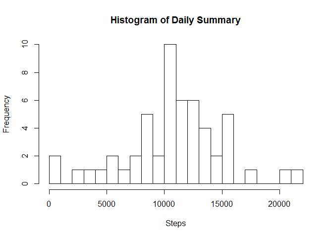
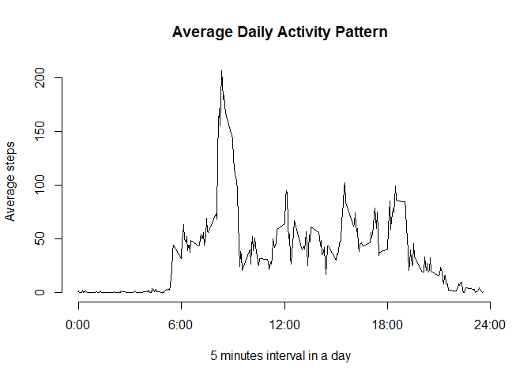
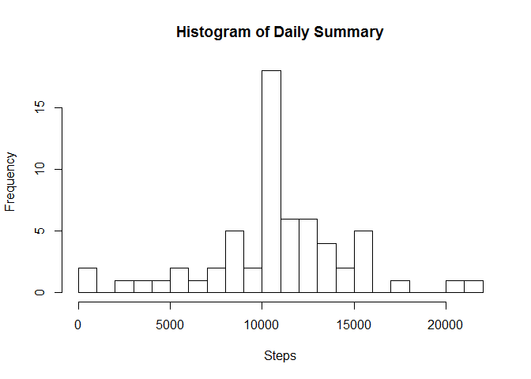
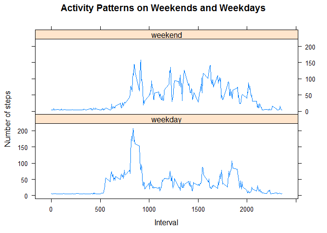

# Reproducible Research: Peer Assessment 1
March 30, 2016  


### Read activity file and remove the na data

```r
library(dplyr)
```

```
## Warning: package 'dplyr' was built under R version 3.2.4
```

```
## 
## Attaching package: 'dplyr'
```

```
## The following objects are masked from 'package:stats':
## 
##     filter, lag
```

```
## The following objects are masked from 'package:base':
## 
##     intersect, setdiff, setequal, union
```

```r
unzip("~./R/repdata-data-activity.zip","activity.csv")
activities<-read.csv("activity.csv")
a_data<-activities[!is.na(activities$steps),]
```
## What is mean total number of steps taken per day? show by drawing historgram

```r
date_data<-group_by(a_data, date)
day_summary<-summarize(date_data, step_sum=sum(steps))
hist(day_summary$step_sum, breaks =20,xlab="Steps",main="Histogram of Daily Summary")
```



```r
mean(day_summary$step_sum)
```

```
## [1] 10766.19
```

```r
median(day_summary$step_sum)
```

```
## [1] 10765
```
## What is the average daily activity pattern?

```r
interval_data<-group_by(a_data, interval)
interval_summary<-summarize(interval_data,step_mean=mean(steps))
with(interval_summary, plot(interval, step_mean, type="l", main="Average Daily Activity Pattern", xlab="5 minutes interval in a day", ylab="Average steps",axes=F))
axis(2)
axis(1,at=c(0,600,1200,1800,2400), label = c("0:00","6:00","12:00","18:00","24:00"))
```



## interval of maximum number of steps

```r
interval_summary[which.max(interval_summary$step_mean),]
```

```
## Source: local data frame [1 x 2]
## 
##   interval step_mean
##      (int)     (dbl)
## 1      835  206.1698
```
# Imputing missing values
## 1.calculate the total number of missing values in the dataset 

```r
sum(is.na(activities$steps))
```

```
## [1] 2304
```
## 2. replace missing data with average: show no more missing data
##    conver average step into integer steps
### 3. Create a new dataset that is equal to the original dataset but with the missing data filled in

```r
impute_data <- transform(activities, steps=ifelse(is.na(steps), as.integer(mean(day_summary$step_sum)/24/12), steps))
sum(is.na(impute_data))
```

```
## [1] 0
```
## 4.draw historgram and compute mean and median after replacing missing data

```r
date_impute_data<-group_by(impute_data, date)
day_impute_summary<-summarize(date_impute_data, step_sum=sum(steps))

hist(day_impute_summary$step_sum, breaks =20,xlab="Steps",main="Histogram of Daily Summary")
```



```r
mean(day_impute_summary$step_sum)
```

```
## [1] 10751.74
```

```r
mean(day_impute_summary$step_sum)-mean(day_summary$step_sum)
```

```
## [1] -14.45097
```
## the different is because of replaceing the missing value with the around of mean
## which is smaller than tru mean so the resulted mean and median will be smaller

```r
median(day_impute_summary$step_sum)
```

```
## [1] 10656
```

```r
median(day_impute_summary$step_sum)-median(day_summary$step_sum)
```

```
## [1] -109
```
# Are there differences in activity patterns between weekdays and weekends?

```r
library(lattice)
week <- factor(weekdays(as.Date(date_impute_data$date)) %in% c("Saturday","Sunday"), 
               labels=c("weekday","weekend"), ordered=FALSE)
date_impute_data<-cbind(date_impute_data,weekday=week)

interval_impute_data<-group_by(date_impute_data, interval,weekday)
interval_impute_summary<-summarize(interval_impute_data,step_mean=mean(steps))
xyplot(step_mean ~ interval|weekday, interval_impute_summary, type = "l", layout = c(1,2), xlab = "Interval", ylab = "Number of steps",main = "Activity Patterns on Weekends and Weekdays")
```



## During Weekday, there are some early morning activities, after 10:00AM there are less activities
